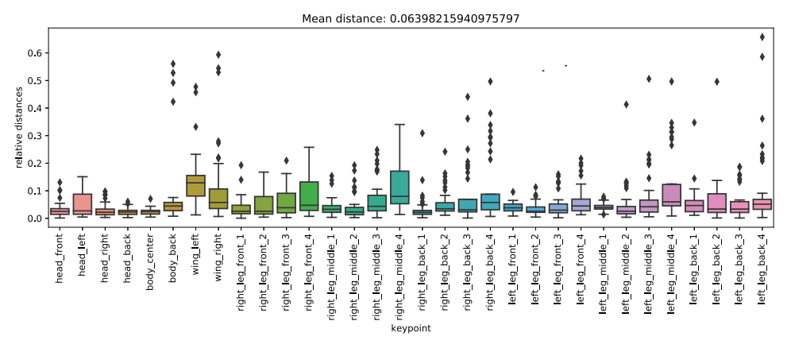

# apic.ai bee pose dataset

The apic.ai bee pose dataset contains annotation of 32 relevant keypoints on the western honey bees. Explicitly inferring the pose is beneficial in order to identify behaviour anomalies such as trembling after poisoning or infections.


<details><summary>Table of Contents</summary><p>

* [Why we created the apic.ai bee pose dataset](#Why-we-created-the-apic.ai-bee-pose-dataset)
* [Get the Dataset](#get-the-dataset)
* [Labels](#Labels)
* [Visualization](#visualization)
* [Benchmark](#benchmark)
* [Contributing](#contributing)
* [Related publications](related-publications)
* [Citing Fashion-MNIST](#citing-fashion-mnist)
* [License](#license)
* [Contact](#contact)
</p></details><p></p>

## Why we created the apic.ai bee pose dataset

In recent years, entomologists have been observing a global decline in the population of pollinating insects. This is of considerable concern since the global agricultural industry is heavily dependent on pollination.
One rather prominent representative of the species affected is the western honey bee (Apis mellifera). Unfortunately, the phenomenon cannot be traced to a single root cause. Recent research on honey bee population decline and colony collapse disorder (CCD) is suggesting a multitude of influencing factors. Namely harmful pesticides, parasites, diseases, malnutrition and intruders. Furthermore urbanization and intensive monoculture cultivation are man-made causes. It is difficult to determine which of those factors ultimately lead to the death of a specific colony. Deeper understanding of the ecosystem and human impact on nature is required as well as integrating this information in short and long-term decisionmaking. Specially recognising and analysing changes in behaviour yields major insights into these causes. Therefore, [we](https://apic.ai) are releasing a dataset about bee pose analysis, to enable the computer science community to contribute to solving this issue.

## Get the dataset

First clone the dataset itself.

```python
git clone https://.../apic-bee-pose-dataset
cd apic-bee-pose-dataset
```

| Xtrain        | Xtest           | X  |
| ------------- |:-------------:| -----:|
| 191      | 38 | 229 |

### Labels

The bees have annotations for 32 relevant keypoints.


<details><summary>Color definition</summary><p>

```python
head_color = (0, 0, 255)
body_color = (255, 0, 0)
wing_color = (0, 255, 0)
left_leg_color = (0, 255, 255)
right_leg_color = (255, 255, 0)
```
</p></details><p></p>


<details><summary>Keypoint definition</summary><p>

```python
{
   "0":{
      "name":"head_front",
      "color":head_color
   },
   "1":{
      "name":"head_left",
      "color":head_color
   },
   "2":{
      "name":"head_right",
      "color":head_color
   },
   "3":{
      "name":"head_back",
      "color":body_color
   },
   "4":{
      "name":"body_center",
      "color":body_color
   },
   "5":{
      "name":"body_back",
      "color":body_color
   },
   "6":{
      "name":"wing_left",
      "color":wing_color
   },
   "7":{
      "name":"wing_right",
      "color":wing_color
   },
   "8":{
      "name":"right_leg_front_1",
      "color":right_leg_color
   },
   "9":{
      "name":"right_leg_front_2",
      "color":right_leg_color
   },
   "10":{
      "name":"right_leg_front_3",
      "color":right_leg_color
   },
   "11":{
      "name":"right_leg_front_4",
      "color":right_leg_color
   },
   "12":{
      "name":"right_leg_middle_1",
      "color":right_leg_color
   },
   "13":{
      "name":"right_leg_middle_2",
      "color":right_leg_color
   },
   "14":{
      "name":"right_leg_middle_3",
      "color":right_leg_color
   },
   "15":{
      "name":"right_leg_middle_4",
      "color":right_leg_color
   },
   "16":{
      "name":"right_leg_back_1",
      "color":right_leg_color
   },
   "17":{
      "name":"right_leg_back_2",
      "color":right_leg_color
   },
   "18":{
      "name":"right_leg_back_3",
      "color":right_leg_color
   },
   "19":{
      "name":"right_leg_back_4",
      "color":right_leg_color
   },
   "20":{
      "name":"left_leg_front_1",
      "color":left_leg_color
   },
   "21":{
      "name":"left_leg_front_2",
      "color":left_leg_color
   },
   "22":{
      "name":"left_leg_front_3",
      "color":left_leg_color
   },
   "23":{
      "name":"left_leg_front_4",
      "color":left_leg_color
   },
   "24":{
      "name":"left_leg_middle_1",
      "color":left_leg_color
   },
   "25":{
      "name":"left_leg_middle_2",
      "color":left_leg_color
   },
   "26":{
      "name":"left_leg_middle_3",
      "color":left_leg_color
   },
   "27":{
      "name":"left_leg_middle_4",
      "color":left_leg_color
   },
   "28":{
      "name":"left_leg_back_1",
      "color":left_leg_color
   },
   "29":{
      "name":"left_leg_back_2",
      "color":left_leg_color
   },
   "30":{
      "name":"left_leg_back_3",
      "color":left_leg_color
   },
   "31":{
      "name":"left_leg_back_4",
      "color":left_leg_color
   }
}
```
</p></details><p></p>


<details><summary>Skeleton model definition</summary><p>

```python
[
   [
      "head_front",
      "head_left",
      head_color,
      50
   ],
   [
      "head_front",
      "head_right",
      head_color,
      50
   ],
   [
      "head_front",
      "head_back",
      body_color,
      50
   ],
   [
      "head_back",
      "body_center",
      body_color,
      80
   ],
   [
      "body_center",
      "body_back",
      body_color,
      200
   ],
   [
      "wing_left",
      "head_back",
      wing_color,
      200
   ],
   [
      "wing_right",
      "head_back",
      wing_color,
      200
   ],
   [
      "right_leg_front_1",
      "right_leg_front_2",
      right_leg_color,
      40
   ],
   [
      "right_leg_front_2",
      "right_leg_front_3",
      right_leg_color,
      40
   ],
   [
      "right_leg_front_3",
      "right_leg_front_4",
      right_leg_color,
      60
   ],
   [
      "right_leg_middle_1",
      "right_leg_middle_2",
      right_leg_color,
      50
   ],
   [
      "right_leg_middle_2",
      "right_leg_middle_3",
      right_leg_color,
      50
   ],
   [
      "right_leg_middle_3",
      "right_leg_middle_4",
      right_leg_color,
      70
   ],
   [
      "right_leg_back_1",
      "right_leg_back_2",
      right_leg_color,
      60
   ],
   [
      "right_leg_back_2",
      "right_leg_back_3",
      right_leg_color,
      60
   ],
   [
      "right_leg_back_3",
      "right_leg_back_4",
      right_leg_color,
      80
   ],
   [
      "left_leg_front_1",
      "left_leg_front_2",
      left_leg_color,
      40
   ],
   [
      "left_leg_front_2",
      "left_leg_front_3",
      left_leg_color,
      40
   ],
   [
      "left_leg_front_3",
      "left_leg_front_4",
      left_leg_color,
      60
   ],
   [
      "left_leg_middle_1",
      "left_leg_middle_2",
      left_leg_color,
      50
   ],
   [
      "left_leg_middle_2",
      "left_leg_middle_3",
      left_leg_color,
      50
   ],
   [
      "left_leg_middle_3",
      "left_leg_middle_4",
      left_leg_color,
      70
   ],
   [
      "left_leg_back_1",
      "left_leg_back_2",
      left_leg_color,
      60
   ],
   [
      "left_leg_back_2",
      "left_leg_back_3",
      left_leg_color,
      60
   ],
   [
      "left_leg_back_3",
      "left_leg_back_4",
      left_leg_color,
      80
   ]
]
```
</p></details><p></p>


A definition that is usable in python can be found in [utils/definitions.py](utils/definitions.py) and be used as a lookup table.

## Visualization

```python3
python3 visualization/plotPose.py ./data/labels/... ./data/images/...
```

## Benchmark
For a benchmark we recommend to use the keypoint detection Object Keypoint Similarity (OKS).
```latex
OKS = Σi[exp(-di2/2s2κi2)δ(vi>0)] / Σi[δ(vi>0)]
```

If you use this data for benchmark, please do a pull request and update this Benchmark section with your results.

### Results of our DeepBees Multinet
In our paper [DeepBees](http://openaccess.thecvf.com/content_ICCVW_2019/papers/CVWC/Marstaller_DeepBees_-_Building_and_Scaling_Convolutional_Neuronal_Nets_For_Fast_ICCVW_2019_paper.pdf), we used a custom loss that is defined as.



## Contributing

Thanks for your interest in contributing! There are many ways to get involved; start with our [contributor guidelines](/CONTRIBUTING.md) and then check these [open issues](https://github.com/apic-ai/apic-bee-pose-dataset/issues) for specific tasks.

## Citing apic.ai bee pose dataset
If you use our dataset in a scientific publication, we would appreciate references to the following paper:

**DeepBees-Building and Scaling Convolutional Neuronal Nets For Fast and Large-Scale Visual Monitoring of Bee Hives. [DeepBees – Building and Scaling Convolutional Neuronal Nets For Fast and Large-scale Visual Monitoring of Bee Hives](http://openaccess.thecvf.com/content_ICCVW_2019/papers/CVWC/Marstaller_DeepBees_-_Building_and_Scaling_Convolutional_Neuronal_Nets_For_Fast_ICCVW_2019_paper.pdf)**

Biblatex entry:
```latex
@inproceedings{marstaller2019deepbees,
  title={DeepBees-Building and Scaling Convolutional Neuronal Nets For Fast and Large-Scale Visual Monitoring of Bee Hives},
  author={Marstaller, Julian and Tausch, Frederic and Stock, Simon},
  booktitle={Proceedings of the IEEE International Conference on Computer Vision Workshops},
  pages={0--0},
  year={2019}
}
```

Otherwise use the following attribution:
```
apic.ai bee pose dataset
by apic.ai
```

## Related publications

- [Impact of an Oomen feeding with a neonicotinoid on daily activity and colony development of honeybees assessed with an AI based monitoring device](https://www.biorxiv.org/content/10.1101/2020.02.04.933556v1)
- [Current achievements and future developments of a novel AI based visual monitoring of beehives in ecotoxicology and for the monitoring of landscape structures.](https://www.biorxiv.org/content/10.1101/2020.02.04.933580v1)

## License
The [Attribution-NonCommercial-ShareAlike 4.0 (CC BY-NC-SA 4.0)](LICENSE), Copyright © [2020] [apic.ai GmbH](https://www.apic.ai)

## Contact
If you have questions regarding the dataset or license feel free to contact: data@apic.ai
